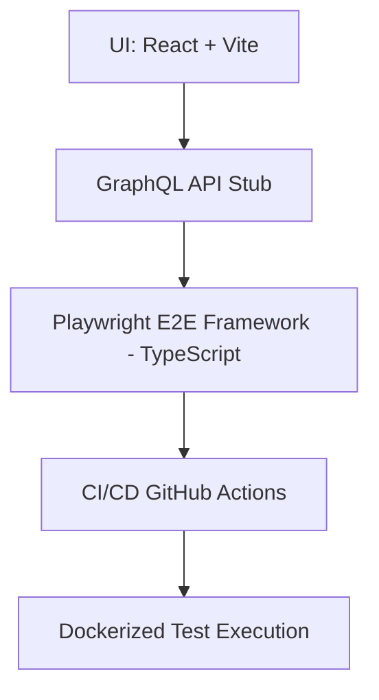

# 🚀 PET Logistics UI + E2E Automation Framework

---

## 📌 Overview

Full-cycle E2E test automation framework simulating a production-like logistics system.  
Built to demonstrate SDET-level engineering practices across UI, API, and CI/CD layers.

---

## 🎯 What This Project Covers

- End-to-end business workflows (booking, pet shipping, logistics)
- UI + API + data consistency validation
- CI/CD-integrated test execution
- Reproducible Docker-based runs

---

## 🧠 Architecture Flow


---

## 🧪 Core Practices

- Page Object Model (POM)
- Persistent auth via `storageState`
- Stable `data-testid` selectors
- Isolated test data lifecycle
- Allure reporting + Playwright traces
  
---

## 🚀 Quick Start

```bash
npm install && npm install --prefix pet-app
cp .env.example .env && cp pet-app/.env.example pet-app/.env

npm run pet:dev   # start UI
npm run e2e       # run full E2E suite

```
---

## 🧩 Tech Stack

- **Automation:** Playwright (TypeScript)  
- **UI:** React + Vite + Ant Design  
- **API:** GraphQL (stubbed)  
- **CI/CD:** GitHub Actions  
- **Containers:** Docker / Docker Compose  
- **Reporting:** Allure  
---

## 💡 Engineering Highlights

- Designed automation framework from scratch  
- Implemented CI/CD-integrated test execution  
- Built reusable session-based authentication strategy  
- Validated UI + API + data consistency in E2E flows  
- Ensured reproducibility via Dockerized environment  

---

## 📚 Why This Project Matters

This project reflects a shift from execution to engineering mindset:

- from running tests  
- to designing reliable validation systems
  
  test execution → quality engineering → system validation

**Core focus:**
architecture • maintainability • reliability • CI/CD integration  
