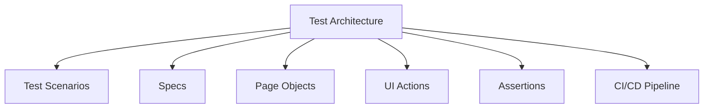

## Project Structure

[...]

```mermaid
  graph TB;
    A[Test Architecture] --> B[Test Scenarios];
    A --> C[Specs];
    A --> D[Page Objects];
    A --> E[UI Actions];
    A --> F[Assertions];
    A --> G[CI/CD Pipeline];
```

[...]

